# Questionário

É um formulário (*online*, no caso do projeto) com perguntas que devem ser respondidas pelos participantes. Questionários podem conter perguntas abertas e fechadas, mas costumam privilegiar as perguntas fechadas, de preenchimento rápido e de fácil análise. Além disso, permitem coletar dados de um grande número de pessoas. Um questionário deve conter instruções claras sobre como responder cada pergunta, indicando explicitamente se uma pergunta admite uma única resposta ou múltiplas respostas. Como não há oportunidade de discutir sobre o questionário ou tirar dúvidas no momento de respondê-lo, as perguntas fechadas geralmente incluem respostas neutras ou alternativas, como “não sei”, “não quero responder” ou “outros”. Além disso, nos questionários não se deve fazer muitas perguntas abertas, pois reduz a taxa de respostas.

## Metodologia
Para o objetivo atual de elicitação de requisitos, a equipe elaborou o formulário no *Google Forms*, e buscou manter as perguntas suficientemente objetivas e claras. O questionário foi iniciado com perguntas gerais sobre o participante, para então fazer perguntas específicas quanto ao tema médico.
As mesmas estão apresentadas a seguir, juntamente com os dados coletados.

## Respostas
 * Dados colhidos nos dias 10/02/2021 e 11/02/2021

---

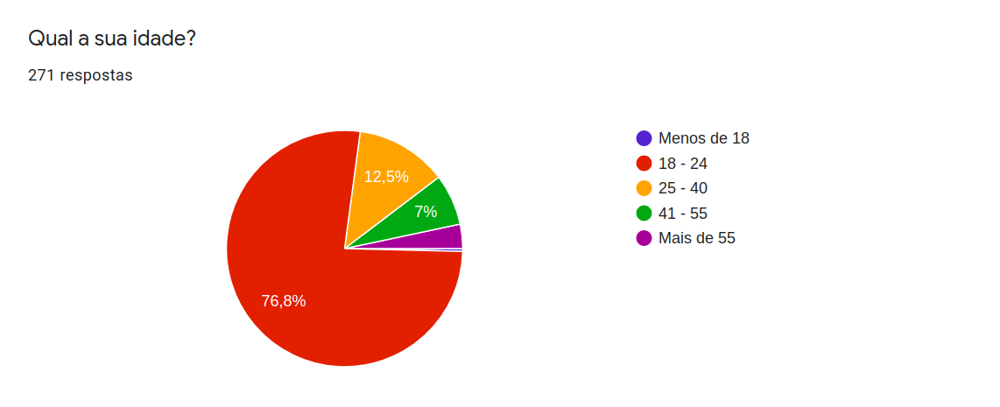

---

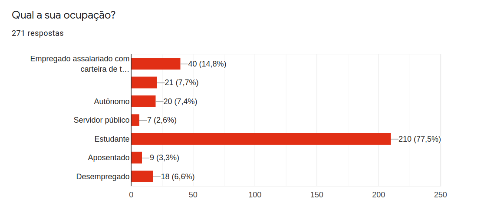

---

---

  
---

- **Essas foram cinco perguntas gerais a respeito do participante. A seguir, a próxima pergunta direciona se o participante responderá as perguntas da "Seção área da saúde" ou se será redirecionado diretamente para a "Seção Paciente".**

---
  
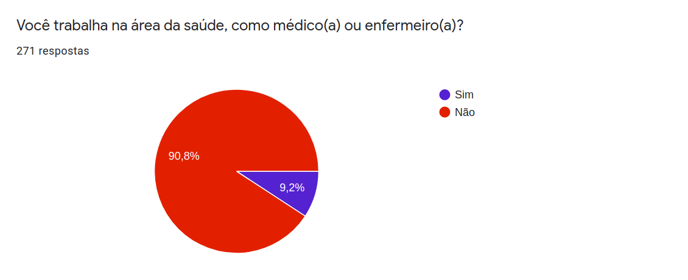

---

- **A partir daqui é iniciada a "Seção área da saúde", para aqueles que responderam "Sim" na pergunta anterior**

---

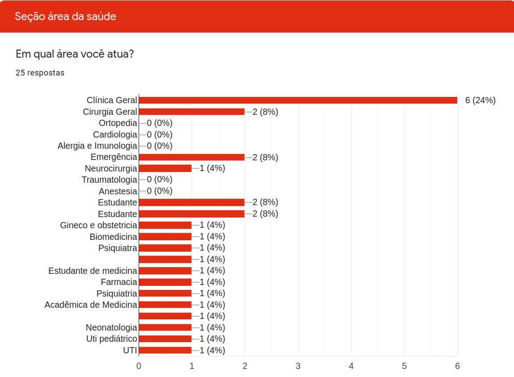

---

- **Pelas três imagens a seguir percebe-se que há uma quantidade relativamente grande de dados considerados importantes em caso de alguma emergência para diferentes especialidades.**

---

---

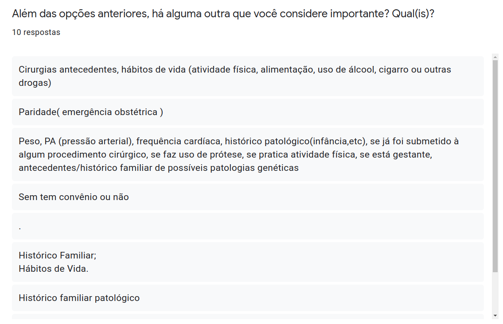

---

---

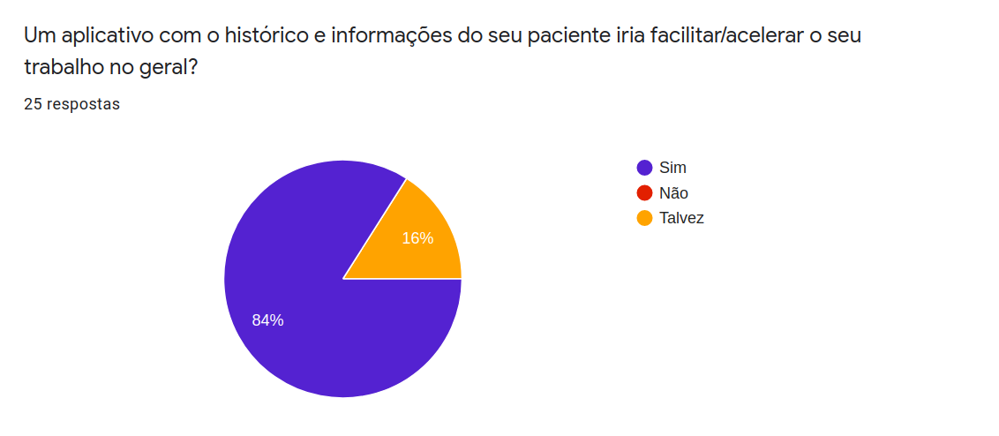

---

- **A partir daqui é iniciada a "Seção Paciente", para todos os participantes**

---

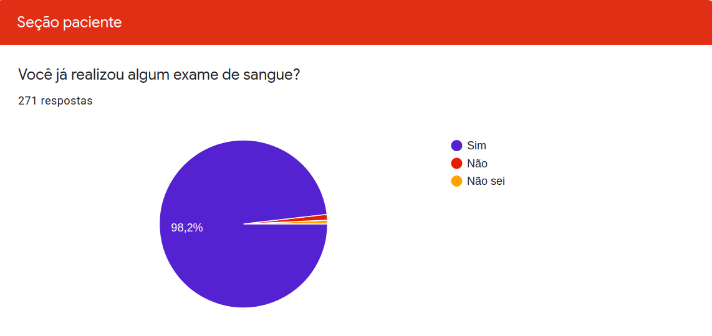

---

---

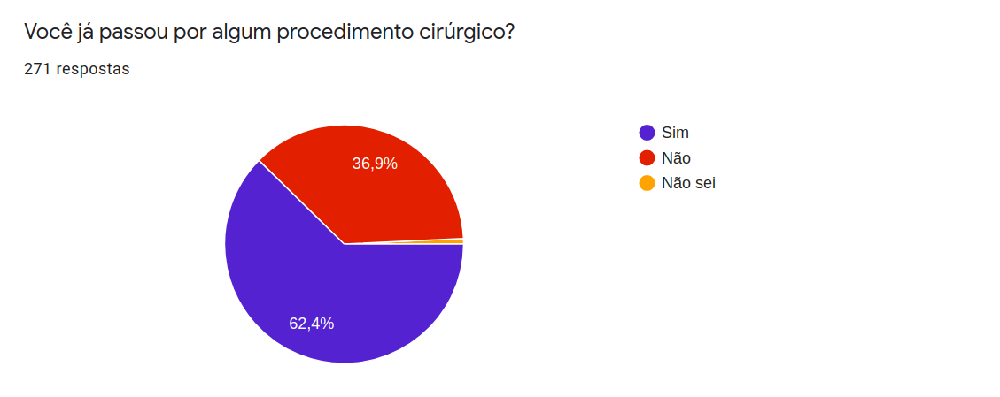

---

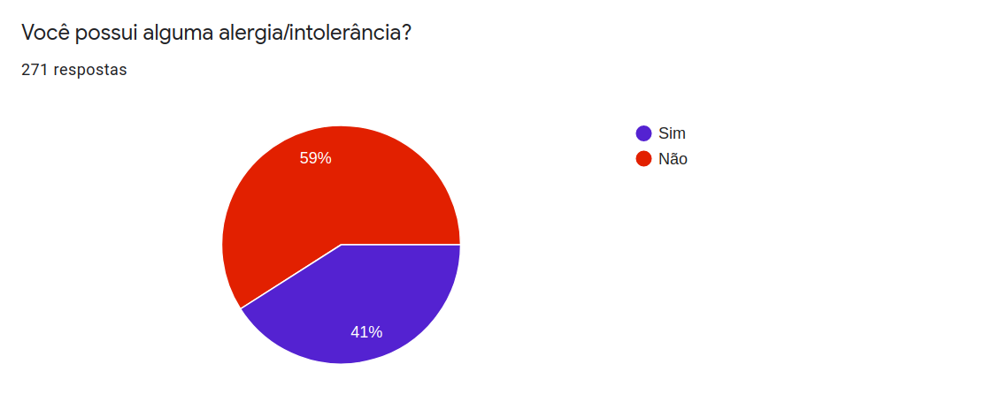

---

- **Caso possuísse alguma alergia ou intolerância, o participante informava qual. Aqui estão algumas das respostas, nas quais amoxicilina, dipirona e alguns outros medicamentos parecem ser relativamente comuns**

---

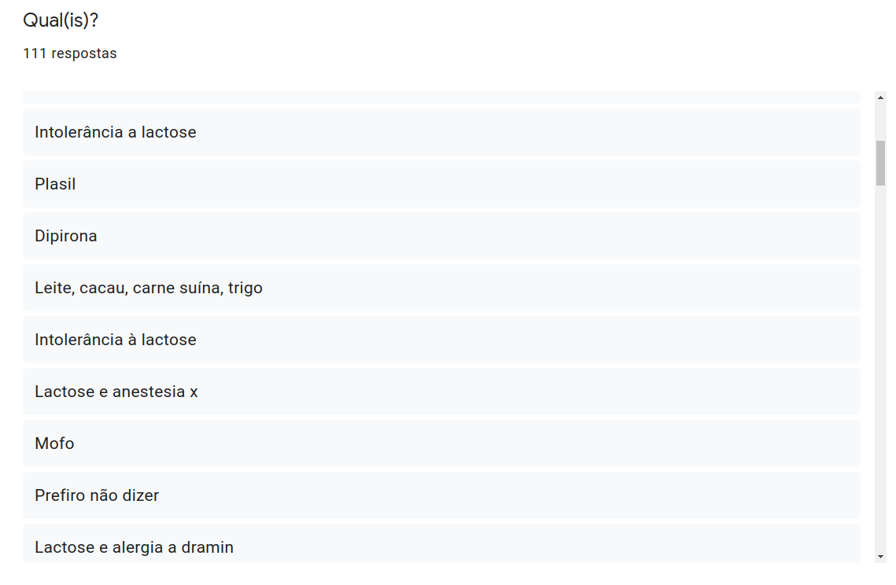
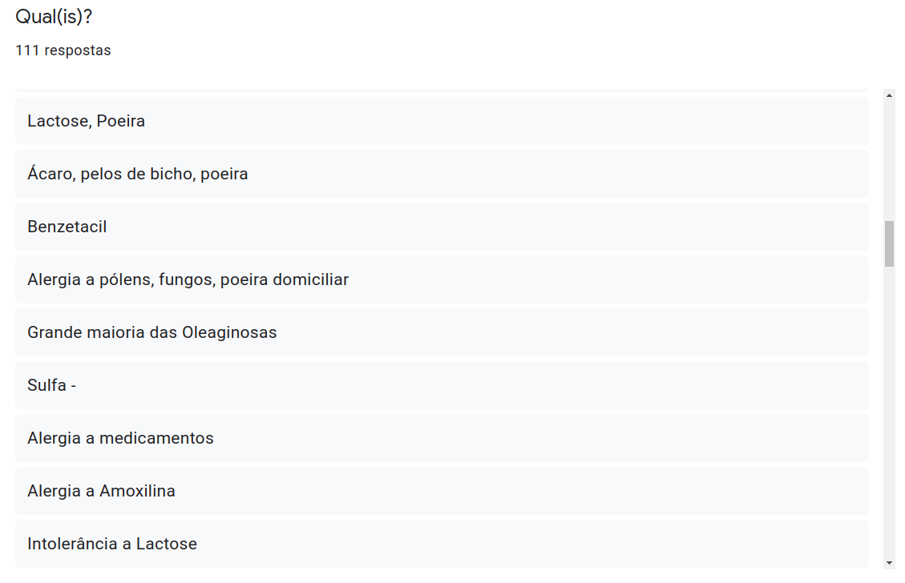
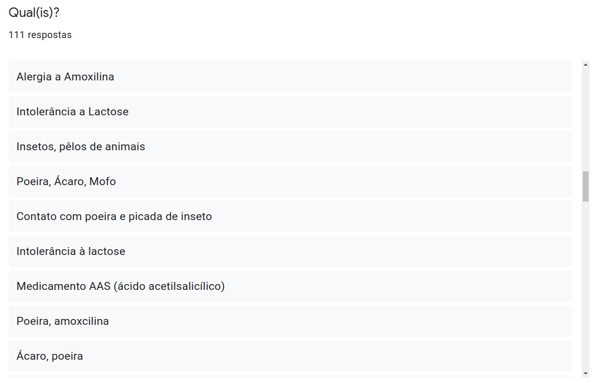
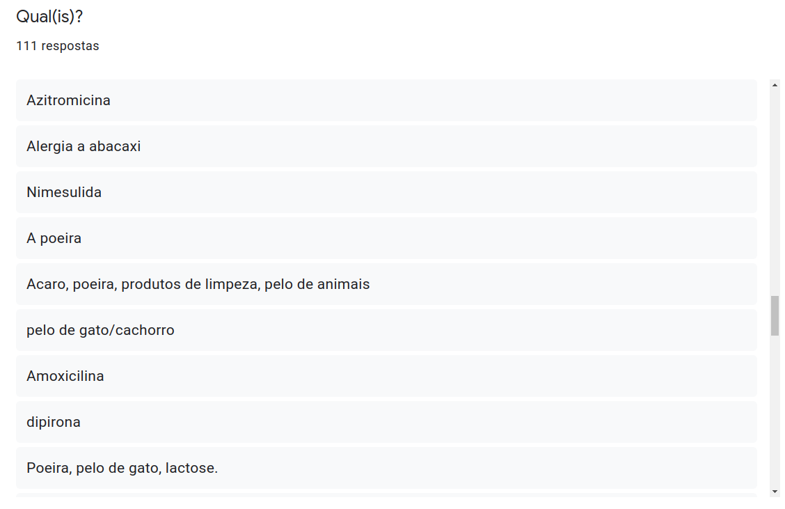

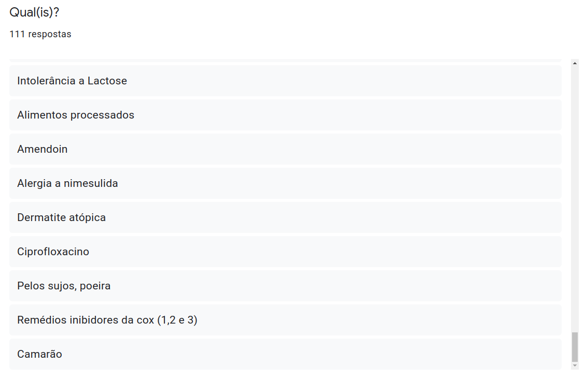

---

- **Cerca de 30% dos participantes tomam algum medicamento de forma contínua, sendo importante ter cuidados na aplicação de outras medicações em alguma situação em que seja necessário**

---

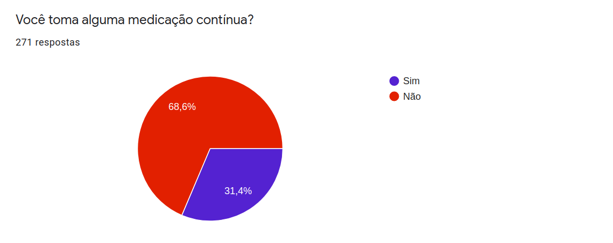

---

- **Como pode ser visto a seguir, vários dos participantes realizam algum exame de rotina, alguns de maneira mais frequente. Isso pode gerar a necessidade de uma boa organização dos exames em um só lugar, para um acesso mais fácil**

---

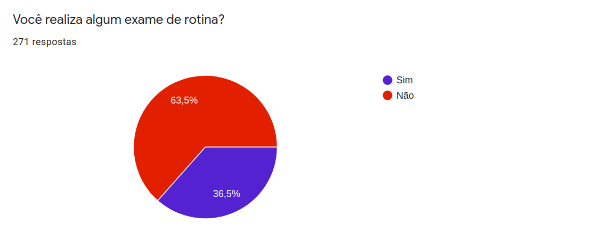

---

---

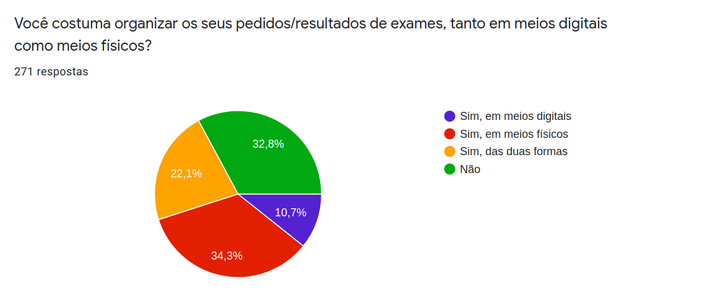

---

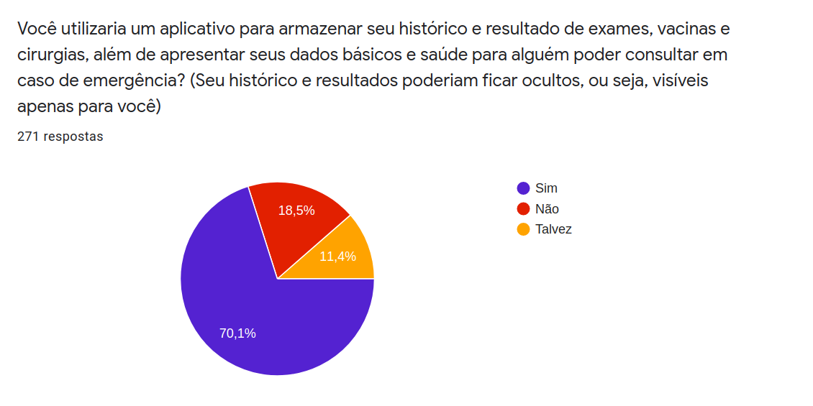

## Resultados
A partir da análise dos dados coletados, percebe-se que a maioria das pessoas costuma utilizar aplicativos no *smartphone*. Unindo isso às respostas da última pergunta, entende-se que é viável um aplicativo para facilitar a organização de documentos de exames, além de apresentar dados gerais de um paciente que esteja em uma situação de emergência. Pode ser útil tanto para o lado do paciente quanto para o profissional da saúde que o atende.

## Referências
BARBOSA, Simone; SILVA, Bruno. Interação Humano-Computador. Rio de Janeiro: Elsevier, 2010.

## Históricos de Revisões

|    Data    | Versão |                  Descrição                   |   Autor(es)    |
| :--------: | :----: | :------------------------------------------: | :------------: |
| 12/02/2021 |  0.1   | Criação do documento e adição da metodologia |  Aline Lermen  |
| 12/02/2021 |  0.2   | Correção da metodologia e adição das referências |  Aline Lermen  |
| 12/02/2021 |  1.0   | Adição dos dados e resultados |  Aline Lermen  |
