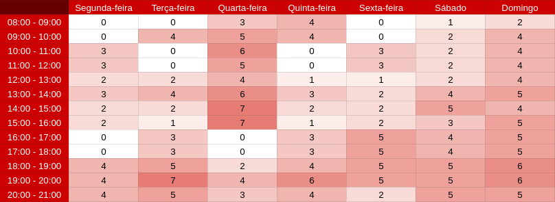

# BPMN

## Históricos de Revisões

|    Data    | Versão |      Descrição       |                                                                                                                             Autor(es)                                                                                                                              |
| :--------: | :----: | :------------------: | :----------------------------------------------------------------------------------------------------------------------------------------------------------------------------------------------------------------------------------------------------------------: |
| 15/02/2021 |  0.1   |   Criação do BPMN    |                           [Danillo Souza](https://github.com/DanilloGS), [Fellipe Araujo](https://github.com/fellipe-araujo), [Gabriel Hussein](https://github.com/GabrielHussein) e [Ithalo Azevedo](https://github.com/ithaloazevedo)                            |
| 15/02/2021 |  1.0   | Criação do documento | [Danillo Souza](https://github.com/DanilloGS),[Fellipe Araujo](https://github.com/fellipe-araujo), [Gabriel Hussein](https://github.com/GabrielHussein), [Ithalo Azevedo](https://github.com/ithaloazevedo) e [Victor Cerqueira](https://github.com/VictorAmaralC) |

## Introdução

BPMN (Business Process Model and Notation) é um conjunto de padrões gráficos e simbólicos utilizados para a representação e modelagem simplicada de processos. Por meio dessa representação, foi possível diagramar todo o processo das sprints do desenvolvimento do projeto Hígia.
Como o grupo a princípio não utiliza papéis da metodologia Scrum, Project Owner, Scrum Master, Dev Ops, etc.., os agentes, de forma geral, foram o time inteiro trabalhando em equipe por meio de reuniões, integrantes que tiveram algumas participações individuais além de algumas duplas ou trios em pareamentos.

## Rituais

### Sprint

Uma sprint é uma reunião de pessoas envolvidas num projeto para promover um desenvolvimento mais focalizado do projeto. As sprints do Projeto Hígia possuem a duração de 1 semana cada.

Fora levantado um documento com os horários disponíveis de cada membro da equipe. A partir do desenvolviento da planilha, foi possível especificar o cronograma semanal de cada membro presente no projeto. Quanto maior o número na célula, maior é a quantidade de integrantes disponíveis.

Foi decidido, a partir da discussão com os membros, que as Sprints irão iniciar às **Terças-feiras** e finalizar às **Segundas-feiras**

### Sprint Review

- O sprint review consite em avaliar as tarefas que foram concluídas e não concluídas para que a equipe possa adaptar o backlog, se surgir a necessidade.

### Sprint Planning

- O sprint planning, ocorre logo após o sprint review, tem como finalidade definir as tarefas que deverão ser realizadas na próxima sprint com base nas entregas realizadas na semana anterior.

### Daily

As Dailys são reuniões rápidas e tem por objetivo trocar conhecimento entre todos os membros acerca do que foi feito desde a última Daily, identificar impedimentos e dificuldades e priorizar o trabalho a ser realizado.
As Dailys serão realizadas 3 vezes por semana, às:

- Dias: terças, quintas e sábados;
- Horário: 19h00 - 19h10.

## Planejamento

### Issues

As issues no Github serão utilizadas para representar todas as tarefas que a equipe realizará durante o desenvolvimento do projeto. Para a melhor entendimento dessas atividades, as issues devem conter:

- Título.
- Responsáveis.
- Labels.
- Story Points.
- Milestone.

### Ferramentas utilizadas

| Ferramenta                                                                                               | Descrição                                                                                                                       |
| -------------------------------------------------------------------------------------------------------- | ------------------------------------------------------------------------------------------------------------------------------- |
| [Git](https://git-scm.com/)                                                                              | Ferramenta utilizada para o controle e versionamento do código.                                                                 |
| [Github](https://github.com/)                                                                            | Plataforma onde será hospedado o repositório do código da aplicação.                                                            |
| [Zenhub](https://app.zenhub.com/workspaces/projeto-higia-60230d95feefb4001515bb04/board?repos=335453556) | Utilizado para gerenciar as issues do projeto.                                                                                  |
| [Telegram](https://telegram.org/)                                                                        | Utilizado para comunicação rápida entre a equipe.                                                                               |
| [Discord](https://discord.com)                                                                           | Utilizado para fazer chamadas de voz e vídeo entre o grupo durante as dailys, os pareamentos, as sprint reviews e os plannings. |
| [MindMeister](https://www.mindmeister.com/pt/)                                                           | Utilizado para fazer os brainstormings e o mapa mental.                                                                         |
| [StoryboardThat](https://www.storyboardthat.com/pt)                                                      | Ferramenta para criação dos storyboards.                                                                                        |
| [Figma](https://www.figma.com/)                                                                          | Ferramenta utilizada na prototipação.                                                                                           |
| [Bizagi modeler](bizagi.com)                                                                             | Software utilizado para criação dos diagramas.                                                                                  |
| [Youtube](https://www.youtube.com/)                                                                      | Plataforma para postarmos os videos das apresentações                                                                           |

## Métricas de gerenciamento

### Kanban

Para monitorar e controlar a produção da equipe estamos utilizando o [ZenHub](https://app.zenhub.com/workspaces/projeto-higia-60230d95feefb4001515bb04/board?repos=335453556). O ZenHub é uma extensão integrada ao GitHub, que ajuda no gerenciamento das issues do projeto.

### Cumulative flow

O Cumulative Flow é um instrumento valioso para rastrear e prever projetos ágeis. Ao usá-lo, você pode verificar rapidamente o status atual: quanto trabalho foi feito, o que está em andamento e quanto tempo será necessário para que determinado escopo seja concluído e indentificar graficamente o progresso da equipe.

## Técnica de programação

### Programação pareada

É uma técnica de desenvolvimento de software ágil em que dois programadores trabalham juntos com o intuito de produzir uma única feature. Assim se evita distrações e o desenvolvimento é mais produtivo.
