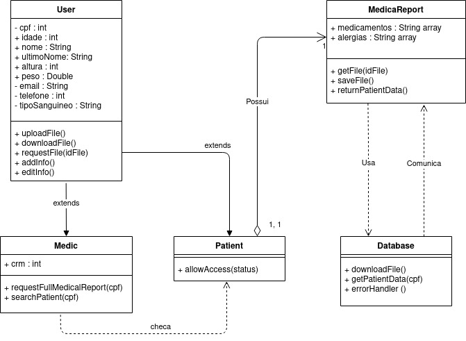

# Diagrama de Classe

## Histórico de versionamento

|    Data    | Versão |                Descrição                 |                                              Autor(es)                                               |
| :--------: | :----: | :--------------------------------------: | :--------------------------------------------------------------------------------------------------: |
| 01/03/2021 |  0.1   |           Criação do documento           | [Victor Amaral](https://github.com/VictorAmaralc)|
| 01/03/2021 |  1.0   | Criação da primeira versão do diagrama | [Victor Amaral](https://github.com/VictorAmaralc) |
| 04/03/2021 |  1.1   | Revisão do documento |[Aline Lermen](https://github.com/AlineLermen)  e [Gabriel Hussein](https://github.com/GabrielHussein)|

## Introdução

 &emsp;&emsp;
Diagramas de classes tem como principal objetivo mapear de forma clara a estrutura de um sistema, modelando suas classes, atributos, métodos, operações e relações entre objetos. Este diagrama auxilia no entendimento da visão geral dos esquemas da aplicação, expressa visualmente as necessidades específicas do sistema, além de ilustrar modelos de dados independente de sua complexidade.
Os diagramas foram produzidos utilizando a ferramenta Draw.io. Nele há todas as classes do nosso sistema, contendo seus atributos e métodos, sendo ocultados métodos auxiliares, além dos seus relacionamentos e cardinalidade.

## Diagrama

### V.1
Após uma revisão foram feitas algumas alterações de nomenclatura.

### V.0

## Referências

[1] **Oque e um diagrama de Classe UML**, Disponível em: <https://www.lucidchart.com/pages/pt/o-que-e-diagrama-de-classe-uml> Acesso em: 01 de março, 2021.

[2] **Stock**, Disponível em: <<https://unbarqdsw.github.io/2020.1_G12_Stock/#/Project/Evaluation>>, Último acesso: 01 de março, 2021.