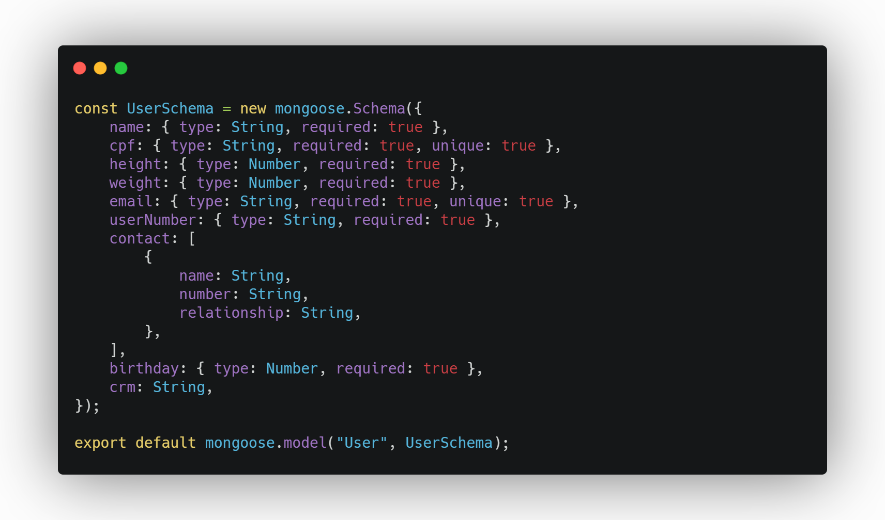
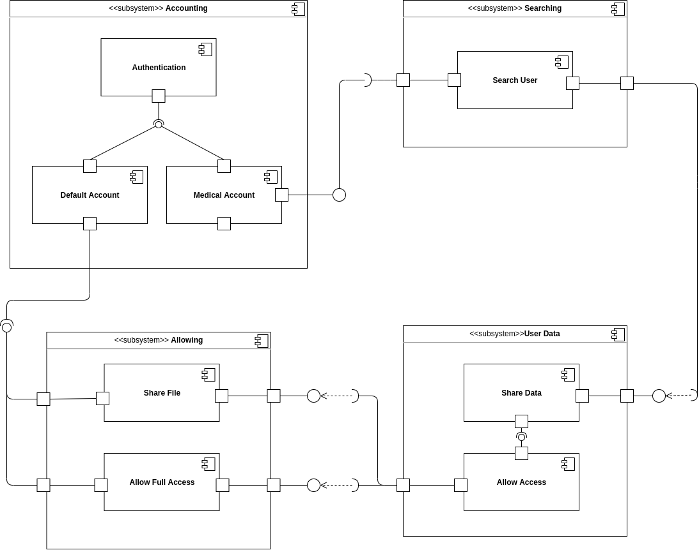

# Padrões GRASP

## Histórico de versionamento                                                                                    

|    Data    | Versão |      Descrição       |                                                                         Autor(es)                                                                         |
| :--------: | :----: | :------------------: | :-------------------------------------------------------------------------------------------------------------------------------------------------------: |
| 16/03/2021 |  0.1   | Criação do documento | [Aline Lermen](https://github.com/AlineLermen), [Gabriel Hussein](https://github.com/GabrielHussein) e [Ithalo Azevedo](https://github.com/ithaloazevedo) |
| 16/03/2021 |  0.2   |  Adição de imagens   |                                                    [Ithalo Azevedo](https://github.com/ithaloazevedo)                                                     |
| 16/03/2021 |  0.3   | Introduzindo padrões GRASP | [Gabriel Hussein](https://github.com/GabrielHussein) |
| 16/03/2021 |  0.4   | Adição dos padrões Criador e Especialista | [Aline Lermen](https://github.com/AlineLermen) |

## Introdução
 
Os padrões GRASP (*General responsibility assignment software patterns*), ou Padrões de Software para Atribuição de Responsabilidades Gerais, são um conjunto de diretrizes que auxiliam na atribuição de responsabilidades para classes e objetos em projetos orientado a objetos. Essas responsabilidades levam em conta o papel do objeto dentro de um determinado contexto. Também é considerada a possibilidade de interação entre diferentes objetos. A responsabilidade pode ser dividida entre o "fazer" do objeto e o "saber" do objeto. Há um total de nove padrões GRASPs, destes nove, quatro foram escolhidos pelo grupo para auxiliar na modelagem e desenvolvimento da aplicação, são eles:

* Criador
* Controlador
* Polimorfismo
* Especialista

### Criador
O padrão Criador (Creator) determina qual classe deve ser responsável pela criação de novas instâncias. Para essa situação há a seguinte solução que deve ser avaliada:
É atribuída à classe B a responsabilidade de criar uma instância de A se pelo menos um desses casos for verdadeiro:
- B contém ou agrega A
- B registra a existência de A
- B usa A
- B tem os dados necessários para a inicialização de A que serão passados ao construtor de A quando for criada

#### Nível de modelagem
No [diagrama de classes](https://unbarqdsw2020-2.github.io/2020.2_G3_ProjetoHigia/#/./04-diagramasUML/diagramaClasse?id=v1) elaborado, tem-se a classe *User*, a classe de usuários do sistema. Nesse caso, a classe responsável pela criação de instâncias de usuário é a própria classe User.
#### Nível de código
- [**Link para o github**](user.js)

### Controlador
O padrão Controlador (ou Controller) é o padrão que atribui a responsabilidade de receber ou lidar com eventos do sistema a um objeto, sendo a ponte entre a camada de apresentação e a camada lógica. O Controlador não executa as tarefas e sim coordena e delega ao objeto apropriado. 

#### Nível de modelagem
No [diagrama de pacotes](https://unbarqdsw2020-2.github.io/2020.2_G3_ProjetoHigia/#/./04-diagramasUML/diagramaPacote?id=diagrama-de-pacotes-backend-v0), no diagrama de pacotes de *backend*.

#### Nível de código
- [**Link para o github**](UserController.js)

### Especialista
O padrão Especialista é o que determina a atribuição de responsabilidades para a entidade mais especialista em um dado aspecto, não somente a criação de instâncias, mas também aspectos como a melhor entidade para calcular algo ou ordenar.
#### Nível de modelagem
No [diagrama de componentes](https://unbarqdsw2020-2.github.io/2020.2_G3_ProjetoHigia/#/./04-diagramasUML/diagramaComponentes?id=diagrama-de-componentesv1)

#### Nível de código
- [**Link para o github**](SetupServer.js)

