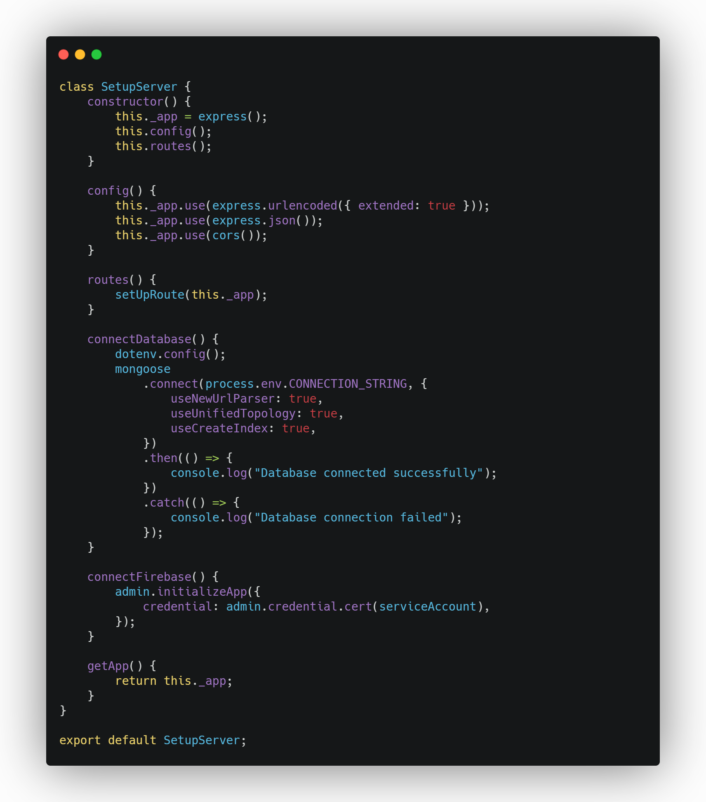
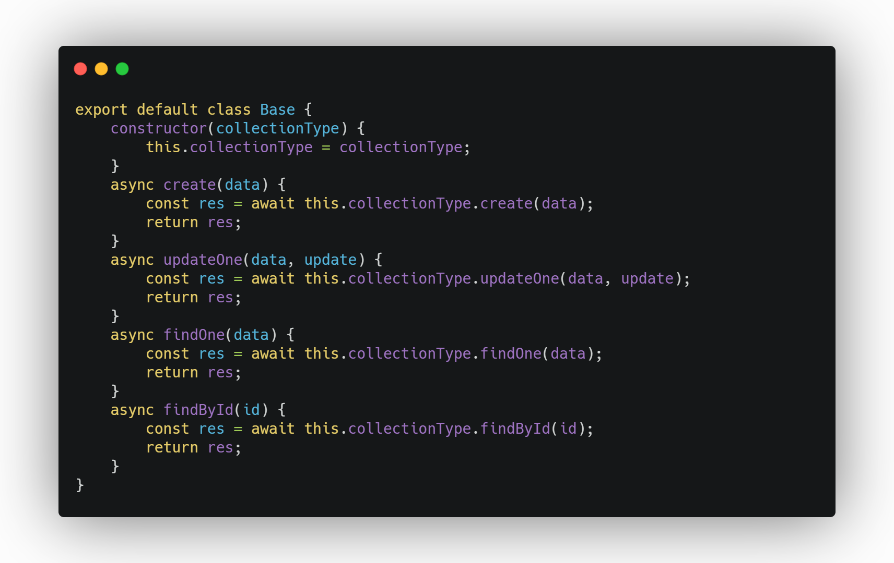

# Padrões GRASP

## Histórico de versões                                                                                    

|    Data    | Versão |                             Descrição                              |                                                                         Autor(es)                                                                         |
| :--------: | :----: | :----------------------------------------------------------------: | :-------------------------------------------------------------------------------------------------------------------------------------------------------: |
| 16/03/2021 |  0.1   |                        Criação do documento                        | [Aline Lermen](https://github.com/AlineLermen), [Gabriel Hussein](https://github.com/GabrielHussein) e [Ithalo Azevedo](https://github.com/ithaloazevedo) |
| 16/03/2021 |  0.2   |                         Adição de imagens                          |                                                    [Ithalo Azevedo](https://github.com/ithaloazevedo)                                                     |
| 16/03/2021 |  0.3   |                     Introduzindo padrões GRASP                     |                                                   [Gabriel Hussein](https://github.com/GabrielHussein)                                                    |
| 16/03/2021 |  0.4   |             Adição dos padrões Criador e Especialista              |                                                      [Aline Lermen](https://github.com/AlineLermen)                                                       |
| 16/03/2021 |  0.5   |                  Adição do padrão de polimorfismo                  |                                                   [Gabriel Hussein](https://github.com/GabrielHussein)                                                    |
| 16/03/2021 |  1.0   |           Revisão do documento e adição das referências            |                                                    [Ithalo Azevedo](https://github.com/ithaloazevedo)                                                     |
| 23/03/2021 |  1.1   |          Revisão do documento e adição de links ao github          |                                                   [Gabriel Hussein](https://github.com/GabrielHussein)                                                    |
| 24/03/2021 |  1.2   |          Adição de informações dos GRASPs não utilizados           |                                                      [Arthur Paiva](https://github.com/ArthurPaivaT)                                                      |
| 24/03/2021 |  1.3   | Adição de mais GRASPs não utilizados e atualização das referências |                                                      [Aline Lermen](https://github.com/AlineLermen)                                                       |

## Introdução
 
Os padrões GRASP (*General responsibility assignment software patterns*), ou Padrões de Software para Atribuição de Responsabilidades Gerais, são um conjunto de diretrizes que auxiliam na atribuição de responsabilidades para classes e objetos em projetos orientado a objetos. Essas responsabilidades levam em conta o papel do objeto dentro de um determinado contexto. Também é considerada a possibilidade de interação entre diferentes objetos. A responsabilidade pode ser dividida entre o "fazer" do objeto e o "saber" do objeto. Há um total de nove padrões GRASPs, destes nove, quatro foram escolhidos pelo grupo para auxiliar na modelagem e desenvolvimento da aplicação, são eles:

* Criador
* Controlador
* Polimorfismo
* Especialista

## Criador
O padrão Criador (Creator) determina qual classe deve ser responsável pela criação de novas instâncias. Para essa situação há a seguinte solução que deve ser avaliada:
É atribuída à classe B a responsabilidade de criar uma instância de A se pelo menos um desses casos for verdadeiro:
- B contém ou agrega A
- B registra a existência de A
- B usa A
- B tem os dados necessários para a inicialização de A que serão passados ao construtor de A quando for criada

### Nível de modelagem
No [diagrama de classes](https://unbarqdsw2020-2.github.io/2020.2_G3_ProjetoHigia/#/./04-diagramasUML/diagramaClasse?id=v2) elaborado, tem-se a classe *User*, a classe de usuários do sistema. Nesse caso, a classe responsável pela criação de instâncias de usuário é a própria classe User.
### Nível de código
- [**Link para o github**](https://github.com/UnBArqDsw2020-2/2020.2_G3_ProjetoHigia/blob/devel/backend/src/models/User.js)

## Controlador
O padrão Controlador (ou Controller) é o padrão que atribui a responsabilidade de receber ou lidar com eventos do sistema a um objeto, sendo a ponte entre a camada de apresentação e a camada lógica. O Controlador não executa as tarefas e sim coordena e delega ao objeto apropriado. 

### Nível de modelagem
No [diagrama de pacotes](https://unbarqdsw2020-2.github.io/2020.2_G3_ProjetoHigia/#/./04-diagramasUML/diagramaPacote?id=diagrama-de-pacotes-backend-v0), no diagrama de pacotes de *backend* é possível observar a controller como um dos pacotes que lida com eventos do sistema e delega tarefas.
### Nível de código
- [**Link para o github**](https://github.com/UnBArqDsw2020-2/2020.2_G3_ProjetoHigia/blob/devel/backend/src/controller/UserController.js)

## Especialista
O padrão Especialista é o que determina a atribuição de responsabilidades para a entidade mais especialista em um dado aspecto, não somente a criação de instâncias, mas também aspectos como a melhor entidade para calcular algo ou ordenar.
### Nível de código
- [**Link para o github**](https://github.com/UnBArqDsw2020-2/2020.2_G3_ProjetoHigia/blob/devel/backend/src/config/SetupServer.js)

## Polimorfismo
O padrão Polimorfismo é utilizado para solucionar o problema de evitar variação condicional (*if* e *else*) e a troca de componentes sem afetar o cliente final. O padrão atribui responsabilidade as classes por meio de operações polimórficas quando temos comportamentos dinâmicos, ou seja, comportamentos que variam de acordo com o tipo (classe). É um padrão que facilita futuras manutenções e possibilita acoplamento de código.
### Nível de código
- [**Link para o github**](https://github.com/UnBArqDsw2020-2/2020.2_G3_ProjetoHigia/blob/devel/backend/src/Database/Base.js)

## GRASPs Não Utilizados

### Baixo Acoplamento

Determina que as classes não devem depender de objetos concretos e sim de abstrações, para permitir que haja mudanças sem impacto.

Para que o padrão de baixo acoplamento seja bem aplicado, é necessária a possibilidade do uso de uma abstração de classes, o que não coube no projeto já que os métodos da aplicação necessitam de informações do objeto concreto. 

### Indireção

Este padrão ajuda a manter o baixo acoplamento, através de delegação de responsabilidades através de uma classe mediadora.

Na aplicação da indireção, há um intermediário entre classes que irá mediá-las de forma que elas não estejam diretamente acopladas. Devido ao tamanho escopo do projeto, este padrão não foi aplicado, pois as classes estão se relacionando diretamente, não havendo necessariamente a necessidade de um intermediário.

### Alta Coesão

Este padrão determina que as classes devem se focar apenas na sua responsabilidade.

Este padrão não foi diretamente aplicado ao projeto devido a existência de estruturas onde os dados referentes a um usuário estarão salvos também na classe Medical Report, que contém dados relativos à saúde e informações médicas gerais pertencentes ao usuário.

### Fabricação própria

É uma classe que não representa nenhum conceito no domínio do problema, ela apenas funciona como uma classe prestadora de serviços, e é projetada para que possamos ter um baixo acoplamento e alta coesão no sistema.

Não foram usadas classes de fabricação própria, já que na aplicação os eventos são tratados em métodos diretos entre as classes. Além disso, os padrões de baixo acoplamento e alta coesão não foram diretamente aplicados.

### Proteção contra Variações

Protege o sistema com a variação de componentes, encapsulando o comportamento que realmente importa.

Não foram identificados pontos de instabilidade previsíveis no escopo do projeto. Dessa forma, não foi necessário, a princípio, aplicar o padrão de Proteção contra variações.

## Referências
- GRASP: Designing Objetos com Responsabilidades. Acesso em: https://www.ic.unicamp.br/~ariadne/mc436/1s2017/Lar16GRASP.pdf. Último de acesso: 16/03/2021.
- Padrões GRASP. Acesso em: http://www.facom.ufu.br/~bacala/ESOF/05a-Padrões%20GRASP.pdf. Último de acesso: 16/03/2021.
- Desenvolvimento com qualidade com GRASP. Acesso em: https://www.devmedia.com.br/desenvolvimento-com-qualidade-com-grasp/28704. Último de acesso: 16/03/2021.
- Padrões GRASP - Padrões de Atribuir Responsabilidades. Acesso em: https://medium.com/@leandrovboas/padr%C3%B5es-grasp-padr%C3%B5es-de-atribuir-responsabilidades-1ae4351eb204. Último de acesso: 24/03/2021. 
