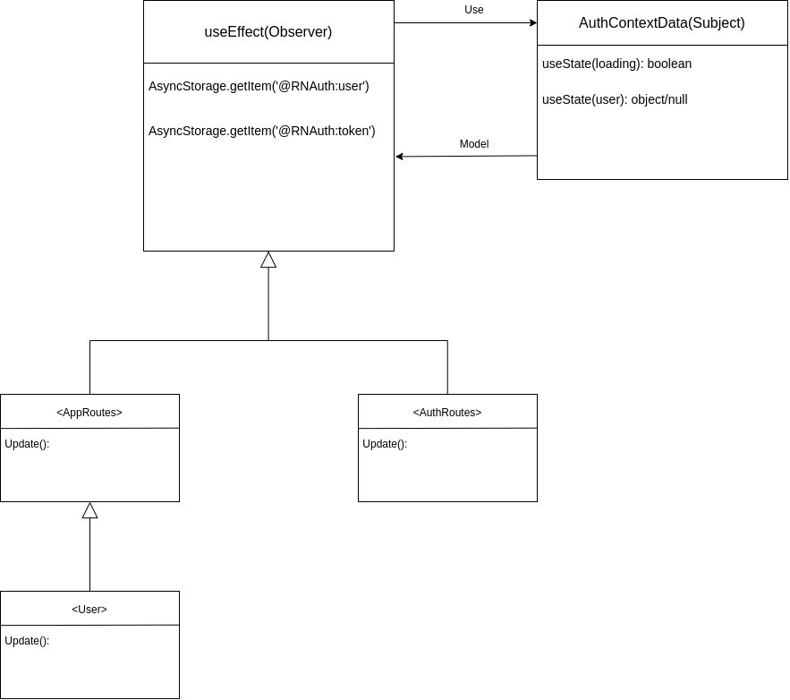

# GoFs Comportamentais

## Histórico de versionamento

|    Data    | Versão |                    Descrição                     |                      Autor(es)   |
| :--------: | :----: | :----------------------------------------------: | :-------------------------------------------------------------------------------------------------: |
| 22/03/2021 |  0.1   |             Criação do documento GoF Comportamental        | [Arthur Paiva](https://github.com/arthurpaivat), [Aline Lermen](https:/github.com/alinelermen) e [Fellipe Araujo](https://github.com/fellipe-araujo)  |
| 22/03/2021 |  0.2   |             Adição de exemplos da aplicação        | [Arthur Paiva](https://github.com/arthurpaivat), [Aline Lermen](https:/github.com/alinelermen) e [Fellipe Araujo](https://github.com/fellipe-araujo)  |
| 22/03/2021 | 1.0 |            Adição de imagens                          | [Arthur Paiva](https://github.com/arthurpaivat), [Aline Lermen](https:/github.com/alinelermen) e [Fellipe Araujo](https://github.com/fellipe-araujo)  |
| 23/03/2021 | 1.1 |            Introdução do state e adição de referências                         |[Gabriel Hussein](https://github.com/GabrielHussein) e [Victor Cerqueira](https://github.com/VictorAmaralC) |

## Observer

 &emsp;&emsp;
O padrão GoF Observer é um padrão de projeto comportamental que permite definir um mecanismo de assinatura para notificar múltiplos objetos sobre quaisquer eventos que aconteçam com o objeto que eles estão observando.

### Diagrama Genérico

### Pontos positivos
- *Princípio aberto/fechado*. É possível introduzir novas classes assinantes sem ter que mudar o código da publicadora (e vice versa se existe uma interface publicadora);
- É possível estabelecer relações entre objetos durante a execução.

### Pontos negativos
- Os assinantes são notificados em ordem aleatória.

### Aplicação

-  Subject

- Controller

## State

 &emsp;&emsp;
O State é um padrão de design de comportamento que permite alterear o comportamento de um objeto quando seu estado interno muda. Sua ideia principal é que, dado um momento qualquer, exite um número finito de estados do qual o programa pode se encontrar. A partir de um único estado, o programa pode se comportar de diferentes maneiras, e também pode alterar seu estado instantaneamente. Contudo, dependendo do estado atual em que se encontra, o programa pode ou não ir para certos estados pré-definidos. 

### Exemplo

Como ilustrado no diagrama acima, o State exige uma mudança de comportamento para que se possa tomar uma decisão do que fazer em relação ao estado atual da aplicação.

### Aplicação

Dentro do Hígia usaremos o State em diversas partes do projeto, para fins de exemplificação usaremos o sistema de login, que é uma maneira simplificada de ilustrar o sistema de comportamento State.

-> imagem

Como se pode ver, ao acessar com suas credenciais, o usuário muda o estado do programa para ativo, gerando um token de login para o usuário logado, que servirá para manter a área de acesso do usuário (ficha médica, pesquisa, configurações, funcionalidades em geral) acessável.

## Referências

- Projeto Diário da Saúde. Acesso em: https://unbarqdsw.github.io/2020.1_G5_Diario_da_Saude/#gofs_comportamentais/. Último acesso em: 22/03/2021.
- Refactoring Guru - Observer. Acesso em: https://refactoring.guru/pt-br/design-patterns/observer. Último acesso em: 22/03/2021.
- Refactoring Guru - State. Acesso em: https://refactoring.guru/design-patterns/state. Último acesso em: 23/03/2021.
- Projeto Stock. Acesso em: https://unbarqdsw.github.io/2020.1_G12_Stock/#/Project/Estudos/comportamental?id=state. Último acesso em: 23/03/2021.