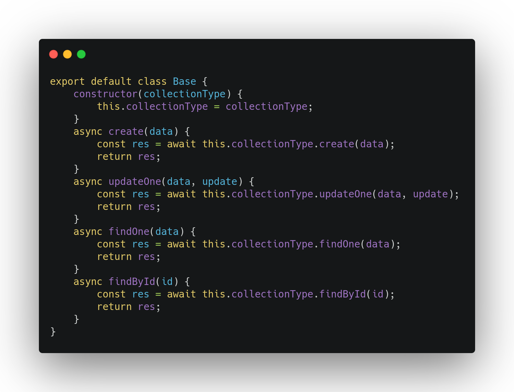
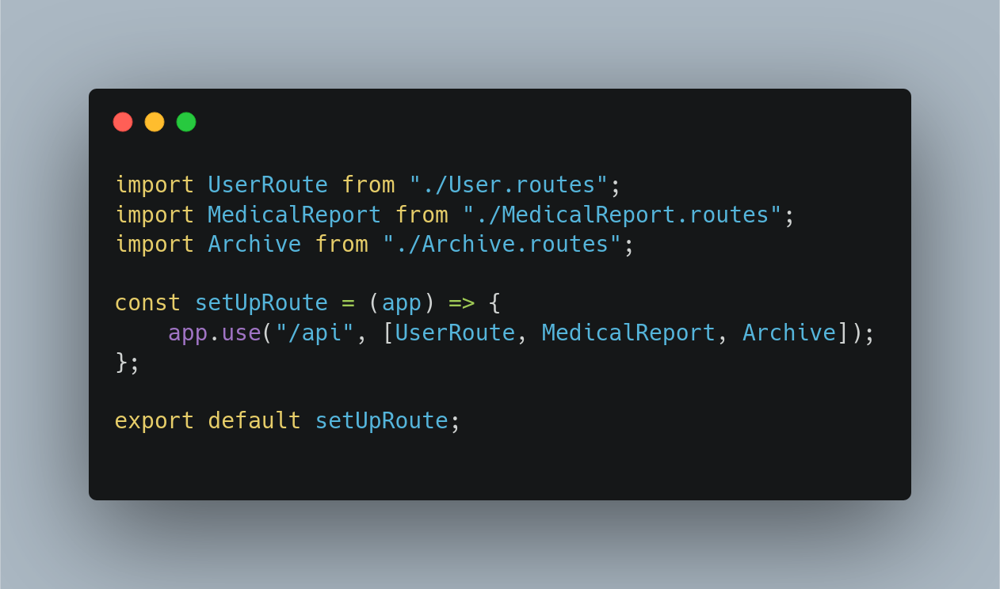

# GoFs Estruturais

## Histórico de versionamento

|    Data    | Versão |                    Descrição                     |                                              Autor(es)                                              |
| :--------: | :----: | :----------------------------------------------: | :-------------------------------------------------------------------------------------------------: |
| 22/03/2021 |  0.1   |             Criação do documento GoF Estrutural             | [Victor Amaral](https://github.com/victoramaralc) |
| 22/03/2021 |  0.2   |             Introdução e Metodologia Decorator      | [Victor Amaral](https://github.com/victoramaralc) |
| 22/03/2021 |  0.3   |             Criação do GoF Decorator            | [Arthur Paiva](https://github.com/ArthurPaivaT) e [Victor Amaral](https://github.com/victoramaralc) |
| 22/03/2021 |  0.4   |             Adição dos Pontos positivos e negativos do decorator   | [Arthur Paiva](https://github.com/ArthurPaivaT) |
| 23/03/2021 |  0.5   |             Criação do GoF Facade   | [Gabriel Hussein](https://github.com/GabrielHussein) e [Ithalo Azevedo](https://github.com/ithaloazevedo) |
| 23/03/2021 |  0.6   |             Adição das imagens de exemplo e implantação   | [Gabriel Hussein](https://github.com/GabrielHussein) e [Ithalo Azevedo](https://github.com/ithaloazevedo) |
| 23/03/2021 |  0.7   |             Adição de pontos positivos e negativos e aplicação  | [Gabriel Hussein](https://github.com/GabrielHussein) e [Ithalo Azevedo](https://github.com/ithaloazevedo) |
| 23/03/2021 |  1.0   |             Adição de referências   | [Gabriel Hussein](https://github.com/GabrielHussein) e [Ithalo Azevedo](https://github.com/ithaloazevedo) |
| 24/03/2021 |  1.1   |             Revisão e ajuste do documento   | [Aline Lermen](https://github.com/AlineLermen) |

## Decorator

 &emsp;&emsp;
O Decorator é um padrão de projeto estrutural que permite acoplar novos comportamentos para objetos ao colocá-los dentro de invólucros de objetos que contém os comportamentos.

### Exemplo

Como no exemplo de decorator base acima, o mesmo irá servir como uma ponte entre o Client e os Decorators que realmente irão alterar o comportamento do objeto concreto. Todos devem implementar a mesma interface.

### Aplicação 

Aqui o objetivo é criar uma nova camada para os métodos principais que o mongoose oferece, como findAll, findOne, create e assim por diante, para que seja utilizada pelas classes. Porém cada classe irá alterar o comportamento de acordo com sua necessidade. Para isso, utilizaremos o método Decorator, onde o Decorator Base irá implementar os métodos do mongoose e assim cada classe poderá herdar desse Decorator Base.

### Decorator Base

### Medical Report

Neste caso, o Medical Report é uma classe cujos objetos serão gerenciados pelo banco usando os métodos da classe Base

### Pontos positivos

- É possível estender o comportamento de um objeto sem fazer um nova subclasse;
- É possível adicionar ou remover responsabilidades de um objeto no momento da execução;
- É possível combinar diversos comportamentos ao envolver o objeto com múltiplos decoradores;
- *Princípio de responsabilidade única*. Você pode dividir uma classe monolítica que implementa muitas possíveis variantes de um comportamento em diversas classes menores

### Pontos Negativos

- É difícil remover um invólucro de uma pilha de invólucros;
- É difícil implementar um decorador de tal maneira que seu comportamento não dependa da ordem do pilha de decoradores;
- A configuração inicial do código de camadas pode ficar bastante feia.

## Facade

 &emsp;&emsp;
O Facade é um padrão de projeto que simplifica a interface para uma biblioteca, framework ou qualquer conjunto completo de classes. Em uma situação em que há a necessidade de inicializar vários objetos para que a implementação funcione, o código fica confuso a pessoas não familiarizadas com o processo e também há a dificuldade de manutenção. Assim, o padrão de projeto Facade implementa uma classe de "Fachada" que fornece uma interface simples para um subsistema mais complexo. Por mais que a Fachada seja limitada em relação as funcionalidades de tal subsistema, ela concentra as funcionalidades com as quais o cliente se importa.

### Exemplo

Como observado no exemplo, várias dependências foram convertidas dentro de uma única interface para organizar o código de forma mais limpa e clara para leitura e manutenção.

### Aplicação

 &emsp;&emsp;
No projeto utilizamos o Facade para condensar as nossas rotas em uma única interface de rotas, para que não seja necessário um excesso de chamadas e referências a rotas distintas. Assim, uma única chamada é necessária para importar todas as rotas que são pertinentes a aplicação.

### Medical Report Routes

### Pontos positivos
- É possível isolar o código da complexidade de um subsistema;
- Fornece um código mais organizado visualmente;
- Permite uma implementação mais simples;
- Facilidade de manutenção futura;

### Pontos negativos
- Pode acontecer da Facade se tornar um *objeto Deus* (objeto que mantém a maior parte das informações do programa inteiro e também fornece a maioria dos métodos para manipular esses dados) que contêm todos os objetos e classes do sistema;
- A Facade é mais limitada do que utilizar diretamente o subsistema do qual ela se torna interface.

## Referências

- Padrão de projeto decorator. Disponível em <https://www.devmedia.com.br/padrao-de-projeto-decorator-em-java/26238>. Último acesso: 22 de março de 2021
- Refactoring Guru - Decorator Pattern. Disponível em <https://refactoring.guru/design-patterns/decorator>. Último acesso: 22 de março de 2021
- Projeto Stock Decorator. Disponível em <https://unbarqdsw.github.io/2020.1_G12_Stock/#/DesignPatterns/Decorator>. Último acesso: 22 de março de 2021
- Refactoring Guru - Facade Pattern. Disponível em <https://refactoring.guru/pt-br/design-patterns/facade>. Último acesso: 23 de março de 2021
- Projeto Stock Facade. Disponível em <https://unbarqdsw.github.io/2020.1_G12_Stock/#/Project/Estudos/estrutural?id=facade>. Último acesso: 23 de março de 2021
- Objeto Deus. Disponível em <https://pt.wikipedia.org/wiki/Objeto_deus>. Último acesso: 23/03/2021.
