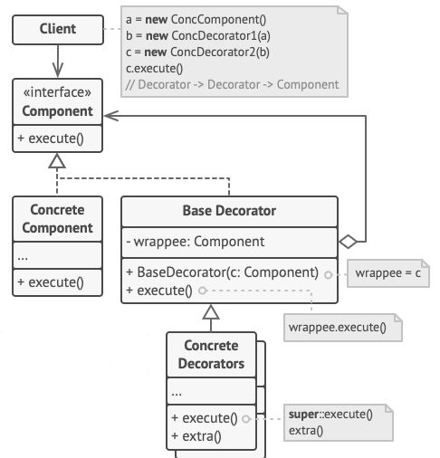

# GoFs Estruturais

## Histórico de versionamento

|    Data    | Versão |                    Descrição                     |                                              Autor(es)                                              |
| :--------: | :----: | :----------------------------------------------: | :-------------------------------------------------------------------------------------------------: |
| 22/03/2021 |  0.1   |             Criação do documento GoF Estrutural             | [Victor Amaral](https://github.com/victoramaralc) |
| 22/03/2021 |  0.2   |             Introdução e Metodologia Decorator      | [Victor Amaral](https://github.com/victoramaralc) |
| 22/03/2021 |  0.3   |             Criação do GoF Decorator            | [Arthur Paiva](https://github.com/ArthurPaivaT) e [Victor Amaral](https://github.com/victoramaralc) |
| 22/03/2021 |  0.4   |             Adição dos Pontos positivos e negativos do decorator   | [Arthur Paiva](https://github.com/ArthurPaivaT) |
| 23/03/2021 |  0.5   |             Criação do GoF Facade   | [Gabriel Hussein](https://github.com/GabrielHussein) e [Ithalo Azevedo](https://github.com/ithaloazevedo) |

## Decorator

 &emsp;&emsp;
O Decorator é um padrão de projeto estrutural que permite que você acople novos comportamentos para objetos ao colocá-los dentro de invólucros de objetos que contém os comportamentos.

### Exemplo

Como no exemplo de decorator base acima, o mesmo irá servir como uma ponte entre o Client e os Decorators que realmente irão alterar o comportamento do objeto concreto. Todos devem implementar a mesma interface.

### Metodologia 

Aqui o objetivo é criar uma nova camada para os métodos principais que o mongoose oferece como findAll, findOne, create e assim por diante para utilização pelas classes, porém cada uma irá alterar o comportamento de acordo com sua necessidade. Para isso, utilizaremos o método Decorator, onde o Decorator Base irá implementar os métodos do mongoose e assim cada classe poderá herdar desse Decorator Base.

### Decorator Base

### Medical Report

Neste caso, o Medical Report é uma classe cujos objetos serão gerenciados pelo banco usando os métodos da classe Base

### Pontos positivos

- Você pode estender o comportamento de um objeto sem fazer um nova subclasse.
- Você pode adicionar ou remover responsabilidades de um objeto no momento da execução.
- Você pode combinar diversos comportamentos ao envolver o objeto com múltiplos decoradores.
- Princípio de responsabilidade única. Você pode dividir uma classe monolítica que implementa muitas possíveis variantes de um comportamento em diversas classes menores

### Pontos Negativos

- É difícil remover um invólucro de uma pilha de invólucros.
- É difícil implementar um decorador de tal maneira que seu comportamento não dependa da ordem do pilha de decoradores.
- A configuração inicial do código de camadas pode ficar bastante feia.

## Facade

 &emsp;&emsp;
O Facade é um padrão de projeto que simplifica a interface para uma biblioteca, framework ou qualquer conjunto completo de classes. Em uma situação em que há a necessidade de inicializar vários objetos para que a implementação funcione, o código fica confuso a pessoas não familiarizadas com o processo e também há a dificuldade de manutenção, o padrão de projeto Facade implementa uma classe de "Fachada" que fornece uma interface simples para um subsistema mais complexo, por mais que a Fachada seja limitada em relação as funcionalidades de tal subsistema ela concentra as funcionalidades que o cliente se importa.

## Referências

- Padrão de projeto decorator, Disponível em <https://www.devmedia.com.br/padrao-de-projeto-decorator-em-java/26238>, último acesso: 22 de março de 2021
- Refactoring Guru - Decorator Pattern, Disponível em <https://refactoring.guru/design-patterns/decorator>, último acesso: 22 de março de 2021
- Projeto Stock Decorator, Disponível em <https://unbarqdsw.github.io/2020.1_G12_Stock/#/DesignPatterns/Decorator>, último acesso: 22 de março de 2021
- Refactoring Guru - Facade Pattern, Disponível em <https://refactoring.guru/pt-br/design-patterns/facade>, último acesso: 23 de março de 2021
- Projeto Stock Facade, Disponível em <https://unbarqdsw.github.io/2020.1_G12_Stock/#/Project/Estudos/estrutural?id=facade>, último acesso: 23 de março de 2021