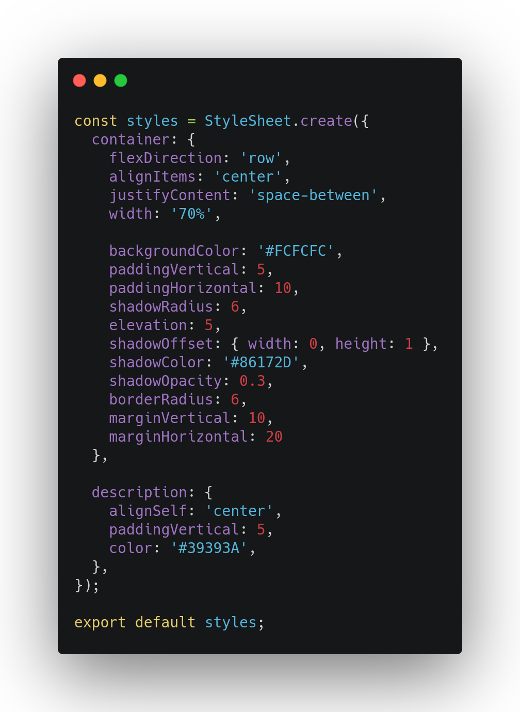
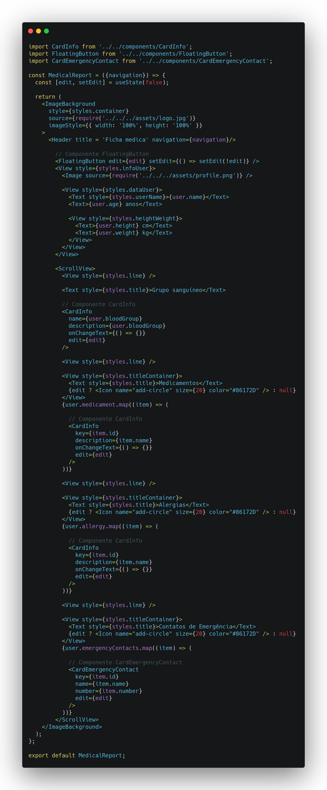

# Padrão de projeto emergente

## Histórico de versionamento

|    Data    | Versão |               Descrição               |                                             Autor(es)                                              |
| :--------: | :----: | :-----------------------------------: | :------------------------------------------------------------------------------------------------: |
| 31/03/2021 |  0.1   |         Criação do documento          | [Ithalo Azevedo](https://github.com/ithaloazevedo), [Aline Lermen](https://github.com/AlineLermen) |
| 31/03/2021 |  0.2   | Adição das informações sobre o padrão | [Ithalo Azevedo](https://github.com/ithaloazevedo), [Aline Lermen](https://github.com/AlineLermen) |
| 31/03/2021 |  0.3   |     Adição das imagens de exemplo     | [Ithalo Azevedo](https://github.com/ithaloazevedo), [Aline Lermen](https://github.com/AlineLermen) |

## Introdução

 &emsp;&emsp;
Os padrões de projeto emergentes são novos padrões que se popularizaram ou se originaram recentemente através de novas tecnologias, <i>frameworks</i> ou linguagens. No nosso caso, utilizamos o Component Patterns que está muito evidente atualmente por causa do ReactJS e do Flutter, <i>frameworks</i> muito populares atualmente. 

## Componentização em React Native

 &emsp;&emsp;
A componentização é uma prática frequentemente utilizada para desenvolver <i>softwares</i> em React Native, além de em alguns outros <i>frameworks</i>. 
Essa prática consiste basicamente em utilizar componentes, criando-os de forma suficientemente genérica para que possam ser reutilizados em boa parte do projeto. 

### Aplicação
O projeto está sendo desenvolvido utilizando o *framework* React Native. A seguir está exemplificada a aplicação dos componentes a nível de código do projeto.

#### Nível de código

 &emsp;&emsp;
Explicação de onde e como foi aplicado o padrão de projeto

- Pastas dos componentes:

- Componente cardInfo:

- Estilização do componente cadInfo:

- Diferentes componentes sendo utilizados na tela da ficha médica:

#### Pontos positivos

- Adaptável. Com os componentes, torna-se mais fácil de adaptar em caso de modificações necessárias, pois o código também fica menos repetitivo;
- Reutilizável. Como os componentes são reutilizáveis, há uma redução de tempo e custo.

#### Pontos negativos

- Complexidade. Se o código for extremamente componentizado, a sua complexidade pode aumentar.
  
### Referências

- React Native Component Patterns. Acesso em: <https://dev.to/mohit199thd/design-patterns-in-react-native-component-patterns-352f>. Último acesso em: 31/03/2021.
- React Components. Acesso em: <https://reactjs.org/docs/glossary.html#components>. Último acesso: 31/03/2021. 
- Components and props. Acesso em: <https://reactjs.org/docs/components-and-props.html>. Último acesso: 31/03/2021.
- Padrões em react: criando componentes. Acesso em: <https://oieduardorabelo.medium.com/padrões-em-react-criando-componentes-d35422034d75>. Último acesso em: 31/03/2020.